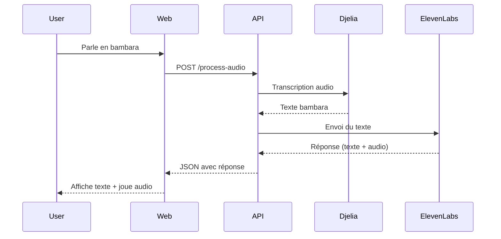

# 🇲🇱 Jarvis - Assistant Vocal Bambara

Assistant vocal intelligent pour la langue bambara, utilisant Djelia AI pour la reconnaissance vocale et ElevenLabs pour les conversations naturelles.

## 🎯 Fonctionnalités

- **🎤 Reconnaissance vocale bambara** : Transcription audio native en bambara via Djelia AI
- **🤖 Agent conversationnel** : Réponses intelligentes via ElevenLabs
- **🔊 Réponses vocales** : Audio de haute qualité
- **🌐 Interface web intuitive** : Enregistrement direct ou upload de fichiers

## 🏗️ Architecture

```
Audio bambara (microphone/fichier)
          ↓
    Djelia AI (transcription)
          ↓
    Agent ElevenLabs (conversation)
          ↓
    Réponse (texte + audio)
```

## 🚀 Démarrage Rapide

### 1. Installation

```bash
# Cloner le projet
git clone https://github.com/Loicgotta/Jarvis-djoula.git
cd Jarvis-djoula

# Installer les dépendances
pip install -r requirements.txt
```

### 2. Lancement

```bash
python app.py
```

L'application sera disponible sur : **http://localhost:8000**

## 📁 Structure du Projet

```
Jarvis-djoula/
├── app.py                          # Application FastAPI principale
├── djelia_transcription.py         # Module Djelia AI
├── elevenlabs_agent.py             # Module ElevenLabs
├── bambara_voice_interface.py      # Interface vocale complète
├── requirements.txt                # Dépendances Python
└── README.md                       # Documentation
```

## 🔧 Modules

### djelia_transcription.py
Module d'intégration avec l'API Djelia AI pour la transcription vocale en bambara.

**Fonctionnalités :**
- Transcription audio → texte en bambara
- Support multi-formats (MP3, WAV, M4A, WEBM, OGG, FLAC)
- Gestion d'erreurs robuste

**Configuration :**
- API Endpoint : `https://djelia.cloud/api/v1/models/transcribe`
- Clé API : `4cc23e20-129b-42a0-af09-ca814e9ac23b`

### elevenlabs_agent.py
Module d'intégration avec l'agent conversationnel ElevenLabs.

**Fonctionnalités :**
- Envoi de messages texte à l'agent
- Récupération des réponses (texte et audio)
- Téléchargement automatique des fichiers audio

**Configuration :**
- Agent ID : `agent_7801k3yd7xb4fgfva2r76j2fk9dm`
- Clé API : `sk_e08a92815b5e911d119065275c82377c0396f3b0b2d80750`

### bambara_voice_interface.py
Interface vocale complète orchestrant le flux Djelia + ElevenLabs.

**Fonctionnalités :**
- Traitement de bout en bout
- Logging détaillé
- Gestion d'erreurs complète

## 🎨 Interface Web

### Deux Options d'Entrée

**Option 1 : Enregistrement Direct** 🎙️
1. Cliquez sur "Enregistrer"
2. Parlez en bambara
3. Cliquez sur "Arrêter"
4. Envoyez l'enregistrement

**Option 2 : Upload de Fichier** 📁
1. Cliquez ou glissez-déposez un fichier audio
2. Sélectionnez votre fichier bambara
3. Envoyez

## 📊 Flux de Données

### Requête
```
POST /process-audio
Content-Type: multipart/form-data

{
  file: <fichier_audio_bambara>
}
```

### Réponse
```json
{
  "transcript": "Texte transcrit en bambara",
  "response": "Réponse de l'agent",
  "audio_file": "fichier_audio.mp3"
}
```

## 🔍 Tests

### Test des Modules Individuels

```bash
# Test Djelia AI
python djelia_transcription.py

# Test ElevenLabs
python elevenlabs_agent.py

# Test Interface Complète
python bambara_voice_interface.py
```

### Logs

Le système affiche des logs détaillés :
- ✅ Succès
- ❌ Erreur
- ⚠️ Avertissement

## 🛠️ API Endpoints

### POST /process-audio
Traite un fichier audio en bambara

**Workflow :**
1. Transcription avec Djelia AI
2. Conversation avec ElevenLabs
3. Retour de la réponse (texte + audio)

### GET /audio/{filename}
Récupère un fichier audio de réponse

### GET /health
Vérification de l'état du service

## 🔐 Configuration

### Clés API

Les clés API sont configurées dans les modules :

**Djelia AI :**
```python
djelia_api_key = "4cc23e20-129b-42a0-af09-ca814e9ac23b"
```

**ElevenLabs :**
```python
elevenlabs_api_key = "sk_e08a92815b5e911d119065275c82377c0396f3b0b2d80750"
elevenlabs_agent_id = "agent_7801k3yd7xb4fgfva2r76j2fk9dm"
```

> **Note :** En production, stockez les clés dans des variables d'environnement via un fichier `.env`

## 📚 Dépendances

- **FastAPI** : Framework web moderne
- **Uvicorn** : Serveur ASGI performant
- **Requests** : Requêtes HTTP pour les APIs externes
- **Python-dotenv** : Gestion de la configuration

## 🌍 Technologies Utilisées

| Technologie | Usage |
|------------|-------|
| **Djelia AI** | Reconnaissance vocale bambara |
| **ElevenLabs** | Agent conversationnel |
| **FastAPI** | Backend API |
| **HTML/CSS/JS** | Interface utilisateur |

## 📋 Formats Audio Supportés

- MP3
- WAV
- M4A
- WEBM
- OGG
- FLAC

## 🔄 Flux Technique Détaillé



## 🚨 Dépannage

### Problème : Erreur de transcription
- Vérifiez que la clé API Djelia est valide
- Assurez-vous que le fichier audio est au bon format
- Vérifiez votre connexion internet

### Problème : Pas de réponse de l'agent
- Vérifiez la clé API ElevenLabs
- Vérifiez l'ID de l'agent
- Consultez les logs pour plus de détails

### Problème : Microphone non détecté
- Vérifiez les permissions du navigateur
- Assurez-vous que le navigateur supporte MediaRecorder
- Utilisez HTTPS ou localhost

## 📖 Documentation des APIs

### Djelia AI
- Site web : https://www.djelia.cloud/
- Première plateforme IA dédiée au bambara

### ElevenLabs
- Documentation : https://elevenlabs.io/docs/conversational-ai/overview
- API Reference : https://elevenlabs.io/docs/api-reference/introduction

## 🤝 Contribution

Les contributions sont les bienvenues ! Pour contribuer :

1. Fork le projet
2. Créez une branche (`git checkout -b feature/AmazingFeature`)
3. Committez vos changements (`git commit -m 'Add AmazingFeature'`)
4. Pushez vers la branche (`git push origin feature/AmazingFeature`)
5. Ouvrez une Pull Request

## 📝 License

Ce projet est sous licence MIT.

## 🙏 Remerciements

- **Djelia AI** pour la reconnaissance vocale bambara de pointe
- **ElevenLabs** pour l'agent conversationnel de haute qualité
- La communauté open source

## 📧 Contact

Pour toute question ou suggestion :
- Créez une issue sur GitHub
- Consultez la documentation

---

**Version :** 1.0.0
**Date :** 2025-12-25
**Status :** ✅ Production Ready
